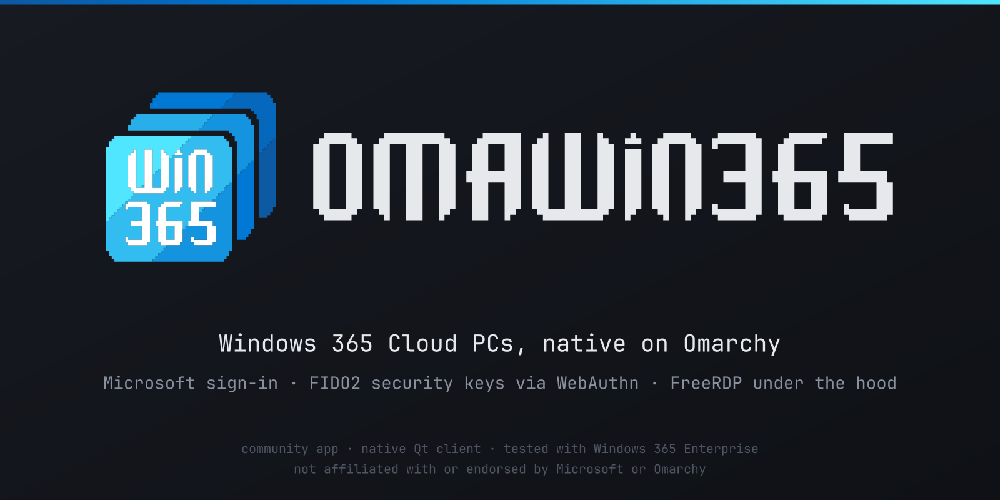

# OMAWIN365



**Pre-release. Looking for reviewers.** OMAWIN365 is a native Qt launcher for Windows 365 Cloud PCs on Omarchy/Arch. It signs in to Microsoft in a private Chromium window and opens your Cloud PC with FreeRDP in a separate window. Importing a connection never connects automatically.

**Why it exists: your security key works *inside* the Cloud PC.** Signing in to Windows 365 with a FIDO2 security key works in supported browsers, Omarchy included. But in my testing the browser-based client couldn't redirect a local key into the remote session, so sign-ins *inside* the Cloud PC (Microsoft 365, admin portals, websites) can't use it. OMAWIN365 uses FreeRDP's WebAuthn redirection: when something in the session asks for your key, a native PIN prompt appears on your Omarchy desktop, and you touch your local key. No raw USB passthrough is involved.

It works end to end with Windows 365 Enterprise on the maintainer's tenant, including:

- downloading the connection file from the portal,
- Microsoft sign-in with a hardware security key,
- in-session security-key sign-ins (native PIN prompt, then touch),
- reconnect, cancel and wrong-PIN recovery.

Other tenants and editions are untested. It has had extensive AI-assisted review but **no independent human security review yet**. Please [help review it](#help-review-it) before trusting it with a work account.

Not affiliated with, endorsed by or supported by Microsoft or Omarchy. Microsoft, Windows, Windows 365 and the redrawn Windows 365 mark are Microsoft trademarks, used here only for identification. Provided **as-is, without warranty**, under the [MIT license](LICENSE); see [third-party notices](THIRD_PARTY_NOTICES.md).

## Build

On Omarchy/Arch with Qt 6.11 (`qt6-base`, `qt6-wayland`, `qt6-svg`), a C++20 compiler, `libx11` and `fontconfig`. Chromium and XWayland are needed at run time.

```sh
make -j4
make test   # needs an X11/XWayland DISPLAY; see docs/TESTING.md
./.build/omawin365
```

The app needs **FreeRDP 3.32.1 built with `WITH_SSO_MIB=OFF`, plus one certificate fix**. Arch's stock `freerdp` (3.31.1) is rejected. The recipe in [`packaging/freerdp`](packaging/freerdp) builds a private copy under `/usr/lib/omawin365/freerdp` without touching the distro package; see [packaging](docs/PACKAGING.md).

**Why the FreeRDP patch:** Microsoft's gateways use wildcard certificates (`*.wvd.microsoft.com`). FreeRDP builds without uriparser discard wildcard names, so valid gateways look like a name mismatch. OMAWIN365 never accepts a certificate prompt, so every connection stopped. [Patch 0003](packaging/freerdp/0003-accept-wildcard-dns-san.patch) fixes this. It was merged upstream as [FreeRDP#13653](https://github.com/FreeRDP/FreeRDP/pull/13653) but is not yet in a FreeRDP release. Once Arch ships a fixed FreeRDP, the app's exact-version check and package dependency will move to stock `freerdp`, and the private copy goes away.

## Help review it

The [security review brief](docs/SECURITY-REVIEW-BRIEF.md) explains what the app does, where the risk is and the five questions we most want answered. It takes about 10 minutes to read. Human reviews and AI-assisted reviews are both welcome; please read [contributing](CONTRIBUTING.md) first. Report anything exploitable privately: see [SECURITY.md](SECURITY.md).

## More

- [Architecture and boundaries](docs/BOUNDARIES.md)
- [Tests](docs/TESTING.md)
- [What has been verified](docs/VERIFICATION.md)
- [Packaging](docs/PACKAGING.md)

Built with AI coding agents (Claude Code and Codex), directed and tested by the maintainer. Never include credentials, PINs, callback URLs, tokens or real connection files in an issue.
