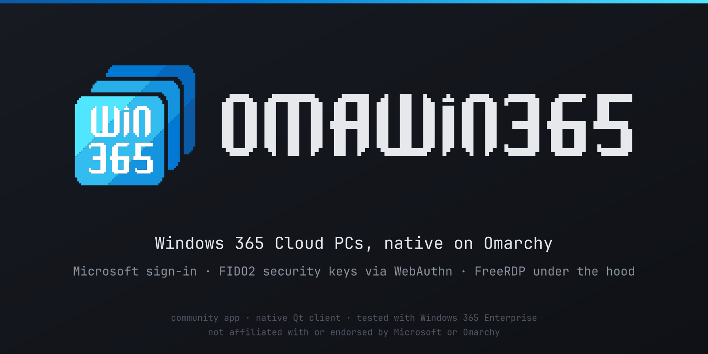

# OMAWIN365



**Early release. Looking for reviewers.** OMAWIN365 is a native Qt launcher for Windows 365 Cloud PCs on Omarchy/Arch. It signs in to Microsoft in a private Chromium window and opens your Cloud PC with FreeRDP in a separate window. Importing a connection never connects automatically.

**Why it exists: your security key works *inside* the Cloud PC.** Signing in to Windows 365 with a FIDO2 security key works in supported browsers, Omarchy included. But in my testing the browser-based client couldn't redirect a local key into the remote session, so sign-ins *inside* the Cloud PC (Microsoft 365, admin portals, websites) can't use it. OMAWIN365 uses FreeRDP's WebAuthn redirection: when something in the session asks for your key, a native PIN prompt appears on your Omarchy desktop, and you touch your local key. No raw USB passthrough is involved.

It works end to end with Windows 365 Enterprise on the maintainer's tenant, including:

- downloading the connection file from the portal,
- Microsoft sign-in with a hardware security key,
- in-session security-key sign-ins (native PIN prompt, then touch),
- reconnect, cancel and wrong-PIN recovery.

Sign-in, audio and in-session security keys were rechecked with FreeRDP 3.33.1. Omarchy's stock FreeRDP 3.32.2 was checked live on November 15: sign-in, microphone and an in-session key worked, and no camera reached the Cloud PC. See [verification](docs/VERIFICATION.md).

Other tenants and editions are untested. It has had extensive AI-assisted review but **no independent human security review yet** (v1.0.0 waits for one). Please [help review it](#help-review-it) before trusting it with a work account.

Not affiliated with, endorsed by or supported by Microsoft or Omarchy. Microsoft, Windows, Windows 365 and the redrawn Windows 365 mark are Microsoft trademarks, used here only for identification. Provided **as-is, without warranty**, under the [MIT license](LICENSE); see [third-party notices](THIRD_PARTY_NOTICES.md).

## Build

On Omarchy/Arch with Qt 6.11 (`qt6-base`, `qt6-wayland`, `qt6-svg`), a C++20 compiler, `libx11`, `libsecret` and `fontconfig`. Chromium and XWayland are needed at run time.

```sh
make -j4
make test   # needs an X11/XWayland DISPLAY; see docs/TESTING.md
./.build/omawin365
```

The app needs the distro's **`freerdp` package: 3.32.2, or 3.33.1 and later 3.33 releases**, built with `WITH_SSO_MIB=OFF` and without external Microsoft sign-in helpers. Arch has 3.33.1, but Omarchy's mirrors still serve 3.32.2. With 3.32.2 the app connects, but security keys inside the Cloud PC are unreliable: 3.32.2 refuses Windows' overlapping WebAuthn channels ([FreeRDP#13741](https://github.com/FreeRDP/FreeRDP/issues/13741), fixed in 3.33.0), so Windows can fall back to its own prompt, and the app says so once connected. For reliable in-session keys before Omarchy's mirrors catch up, also install the optional `omawin365-freerdp` package: [`packaging/freerdp`](packaging/freerdp) builds plain FreeRDP 3.33.1 under `/usr/lib/omawin365/freerdp`, and the packaged launcher uses it when it is installed. For a plain `make` build, run with `PATH=/usr/lib/omawin365/freerdp/bin:$PATH` to use it. See [packaging](docs/PACKAGING.md).

**Why these versions:** Microsoft's gateways use wildcard certificates (`*.wvd.microsoft.com`). FreeRDP 3.32.1 and older, when built without uriparser, discard wildcard names, so valid gateways look like a name mismatch, and OMAWIN365 never accepts a certificate prompt. 3.32.2 fixed that ([FreeRDP#13653](https://github.com/FreeRDP/FreeRDP/pull/13653)). 3.33.0 fixed in-session security keys and several client security issues, but had regressions that 3.33.1 fixes, so 3.33.0 is refused. 3.32.2 is accepted because Omarchy ships it; it lacks those fixes. Once Omarchy's mirrors carry 3.33.1 or later, 3.32.2 support and the optional provider can go.

## Session settings

Settings apply on the next Connect or Reconnect; a running session keeps the settings it started with, including the microphone. Remember sign-in can be changed only while disconnected.

- **Display scale** sets the size of Windows text and icons for every Cloud PC. **Auto** follows the focused Omarchy monitor's scale.
- **Play remote audio**, **Forward microphone** and **Share clipboard** are saved for the selected Cloud PC. Audio and microphone are off until you turn them on and use your default local devices. The clipboard carries text and images, never files. Your organization's policy can still block any of them.
- **Remember sign-in** is for every Cloud PC and is **Off** by default: nothing is saved, and the private sign-in browser forgets everything when the app closes.
  - **Until the app closes** keeps Microsoft's sign-in cookies in memory, so Reconnect doesn't ask again.
  - **On this device (keyring)** also saves Microsoft's long-lived sign-in cookies in your system keyring (Secret Service), so sign-in can survive a restart. Accept Microsoft's **Stay signed in?** prompt to get them. Anything that can read your unlocked keyring can use them until they expire.
  - Either way, Microsoft and your organization's policy decide when to ask again, including for your security key. Only cookies for `login.microsoftonline.com` are kept: never passwords, PINs or tokens.
  - **Forget sign-in** clears memory and the keyring and turns remembering off. It doesn't sign you out of Microsoft.

## Help review it

The [security review brief](docs/SECURITY-REVIEW-BRIEF.md) explains what the app does, where the risk is and the five questions we most want answered. It takes about 10 minutes to read. Human reviews and AI-assisted reviews are both welcome; please read [contributing](CONTRIBUTING.md) first. Report anything exploitable privately: see [SECURITY.md](SECURITY.md).

## More

- [Architecture and boundaries](docs/BOUNDARIES.md)
- [Tests](docs/TESTING.md)
- [What has been verified](docs/VERIFICATION.md)
- [Packaging](docs/PACKAGING.md)

Built with AI coding agents (Claude Code and Codex), directed and tested by the maintainer. Never include credentials, PINs, callback URLs, tokens or real connection files in an issue.
